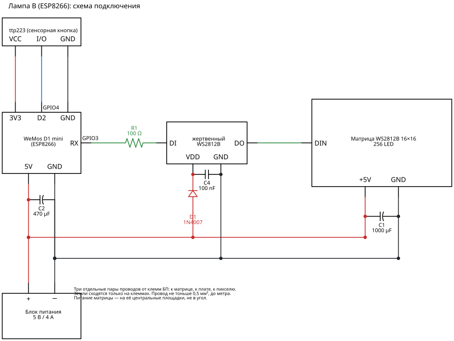

# Вариант на ESP8266

Лампа B: WeMos D1 mini. Полноценная цель сборки, а не запасной план на бумаге: та же
ветка, то же дерево исходников, те же эффекты и панель. Общее для обеих ламп железо —
питание, конденсаторы, согласование уровня линии данных — описано в `docs/esp32s3.md`;
здесь только то, что отличается.

```bash
pio run -e d1_mini
pio device monitor -b 74880
```

## Что меняется в железе



Схема — `docs/schematics/lamp-b-wiring.py` (schemdraw); перерисовать:
`uv run --with schemdraw --with matplotlib python docs/schematics/lamp-b-wiring.py`.

**Лента сидит на `GPIO3` (RX).** DMA-метод NeoPixelBus привязан к этому выводу жёстко —
это ограничение периферии I2S, а не библиотеки. `LED_DATA_PIN=3` в `platformio.ini` —
документация, а не выбор.

Вместе с этим теряется **приём** по Serial. Заливка прошивки и вывод логов работают:
передача идёт по TX, который остаётся свободен.

**Линия данных согласована жертвенным пикселем** — тем самым узлом, что описан в
`docs/esp32s3.md`: WS2812B перед матрицей, питание через два 1N4007 (≈4,2 В), 100 nF у
его выводов, DI с `GPIO3` через 100 Ω, DO — на DIN матрицы. Именно на этой лампе была
поймана каша на яркости 1–4 % и перебраны варианты; в прошивке под узел стоит
`-DLED_LEAD_PIXELS=1`. Соседние флаги в том же окружении — `NPB_CONF_4STEP_CADENCE` и
`LED_DATA_INVERTED` — относятся к отвергнутым вариантам и выключены.

**Кнопка пока отключена** флагом `LAMP_BUTTON_DISABLED`: модуль ttp223 на этой лампе
срабатывает сам по себе (яркость уползает к 1 %), и до разбора с проводкой площадка
в прошивке заглушена.

| Сигнал | GPIO | Примечание |
|---|---|---|
| Лента DIN | `GPIO3` (RX) | жёстко задано DMA-методом NeoPixelBus |
| Кнопка ttp223 | `GPIO4` (D2) | заглушена `LAMP_BUTTON_DISABLED` |

## Что меняется в коде

Только реализация HAL в `src/hal/esp8266/`. `core/` и `effects/` не меняются вовсе —
именно ради этого драйвер ленты спрятан за интерфейсом.

| | ESP32-S3 | ESP8266 |
|---|---|---|
| Вывод ленты | FastLED, RMT | NeoPixelBus, I2S DMA |
| Цветовая математика | FastLED | FastLED |
| Выполнение | две задачи FreeRTOS на двух ядрах | кооперативный цикл |
| Хранилище | GyverDB + LittleFS | то же |
| Serial | 115200 | 74880 — скорость загрузчика, чтобы читать и его сообщения |

## Чего на ESP8266 не будет

**Микрофона.** У I2S на ESP8266 есть отдельные ножки входа (`GPIO12–14`), но делитель
тактовой частоты один на вход и выход: ленте нужно ~3,2 МГц, микрофону ~1 МГц. Пока
лента идёт через I2S DMA, цифровой микрофон не запустить.

**Голоса.** 80 КБ RAM и 80 МГц без ускорителей — там не помещается ни модель слова
активации, ни извлечение признаков.

**Звукореактивных эффектов.** Следствие отсутствия микрофона. Эффекты с тегом
`Reactive` на этой лампе в списке не появляются.

Всё остальное общее: эффекты, кнопка со всеми жестами, веб-панель, MQTT, OTA,
восстановление состояния после пропадания питания, а когда появится маячок — и он.

## Память

Свободной кучи около 40 КБ, и она общая с сетевым стеком и буферами async-сервера.
Отсюда два правила, которые в коде уже учтены: эффект живёт в статической арене, а не в
куче, и рендер не выделяет память вовсе.

Бюджет считается при каждой сборке (`tools/memory_budget.py`), стенд и цифры — в
`docs/memory-esp8266.md`; окружение `d1_mini_mem` собирает прошивку с телеметрией кучи.

При росте библиотеки эффектов на этой плате первой закончится флеш-память программы, а
не оперативная. Оценка: около 40 эффектов средней сложности.

## Панель и sys-контекст

Три причины падений, которые уже ловили на плате, и что с ними сделано:

1. **Стек.** Колбэк сборки панели выполняется внутри приёма WebSocket, то есть в
   sys-контексте SDK, где стека около 1 КБ: ядро по умолчанию вырезает 4 КБ стека `loop()`
   из 5 КБ системного. `disable_extra4k_at_link_time()` в `main.cpp` возвращает стек
   `loop()` в кучу (минус 4 КБ кучи, зато полный системный стек).
2. **Флеш и WiFi из колбэка.** Запись базы, `WiFi.mode()`, `ESP.restart()` из sys-контекста
   роняют плату. Кнопки панели только ставят `Pending`, а `web::tick()` делает работу из
   `loop()`.
3. **Пачка отправок из `loop()`.** Несколько WebSocket-сообщений подряд гонятся с
   подтверждением TCP и дают use-after-free в `AsyncWebSocketClient::_onAck`. Все
   незапрошенные пуши (журнал, перестроение панели) идут через один троттлинг в `WebUi.cpp`.

## OTA

Работает, но ценой половины флеша: 4 МБ делятся на два слота. Размер прошивки
ограничен примерно мегабайтом — с запасом.

Порт защищён паролем `ota_pass` из `secrets.ini` (по умолчанию `smartlamp`): без него
любой в домашней сети мог бы залить прошивку. `espota.py` принимает его через `-a`,
`pio run -t upload` — через `upload_flags = --auth=…`. mDNS не поднимается (он вступал в
multicast-группу на интерфейсе точки доступа, и её закрытие после подключения роняло
плату в IGMP-таймере lwIP — см. `Ota.cpp`), поэтому заливать по IP, а не по `имя.local`.
