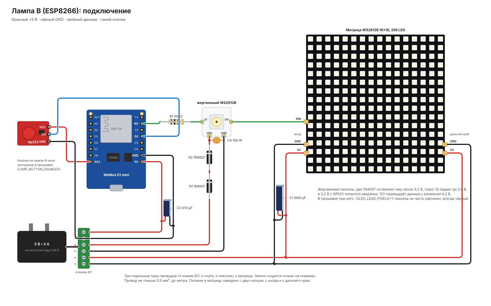

# Железо

Лампа: WeMos D1 mini (ESP8266), матрица WS2812B 16×16, сенсорная кнопка ttp223, блок
питания 5 В / 4 А. Здесь всё, что касается сборки: состав, питание, конденсаторы,
согласование уровня линии данных, распиновка, и что из этого следует для прошивки.

```bash
pio run -e d1_mini
pio device monitor -b 74880
```



Та же схема в принципиальном виде — [`lamp-b-wiring.svg`](schematics/lamp-b-wiring.svg).
Обе рисуются скриптами из `docs/schematics/` (см. `README.md` там же).

## Состав

| Узел | Что | Примечание |
|---|---|---|
| Контроллер | WeMos D1 mini | ESP8266, 4 МБ флеша, 80 КБ RAM |
| Матрица | WS2812B 16×16, 256 LED | гибкая, питание на центральные площадки |
| Кнопка | ttp223 | сенсорная площадка |
| Согласование уровня | жертвенный WS2812B, питание через 1N4007 | см. «Линия данных» |
| Блок питания | 5 В / 4 А | на холостом ходу выдаёт 5,43 В — это важно, см. ниже |

## Питание

```
256 × WS2812B, белый на полной яркости    ≈ 15 А    теоретический максимум
типичный эффект                            3 — 6 А
блок питания                               4 А
плата, пики WiFi TX (~2 мс)                0,5 А
----------------------------------------------------
LED_CURRENT_LIMIT_MA                       3000
```

Ограничитель работает всегда — вопрос только в том, где планка. 3000 мА оставляет
полампера плате и запас блоку питания.

### Разводка: три пары, а не одна шина

От клемм блока питания расходятся **три независимые пары**: к матрице, к плате, к
узлу согласования уровня. Единственная точка, где сходятся земли, — клеммы БП.

Если тянуть одну общую шину, бросок тока ленты просаживает её ровно тогда, когда
передатчик WiFi просит свои 500 мА, и плата уходит в brownout-ресет. Симптом выглядит
как «перезагружается сама по себе на ярких эффектах».

Питание заведено **на центральные площадки матрицы**, а не в угол: до самого дальнего
пикселя тогда полпути по тонким дорожкам гибкой матрицы. При питании из угла дальний
угол тускнеет и уходит в розовый на белом; одной точки в центре на практике хватило.

Провод питания ≥ 0,5 мм², длина меньше метра.

### Конденсаторы

| | Номинал | Место | Что гасит |
|---|---|---|---|
| C1 | 1000 µF / 16 В low-ESR | вход матрицы | пусковой ток 256 драйверов |
| C2 | 470 µF | 5 В у платы | провал шины во время WiFi-пика |
| C3 | 100 nF керамика | 3V3 платы | высокие частоты |
| C4 | 100 nF керамика | питание жертвенного пикселя | то же для узла согласования |
| R1 | 100–470 Ω | в линии DIN между выводом контроллера и первым пикселем | звон на фронте, защита входа |

Их четыре, а не один большой, потому что они работают в разных диапазонах. C1 и C2 —
электролиты, они держат миллисекундные броски. У электролита на высоких частотах велико
последовательное сопротивление, и то, что он пропускает, вычищает керамика C3 и C4.

В прошлой сборке стояли C1 и C2. Без C3 симптом — редкие самопроизвольные перезагрузки.

### Сенсорная кнопка

Провод ttp223 держать подальше от линии данных и силовых проводов ленты, 100 nF по
питанию модуля. При ложных срабатываниях — снизить чувствительность конденсатором на
площадке Cs.

**Сейчас кнопка отключена** флагом `LAMP_BUTTON_DISABLED`: модуль срабатывает сам по
себе (яркость уползает к 1 %), и до разбора с проводкой площадка в прошивке заглушена.

## Линия данных: почему 3,3 В не хватает и что с этим делать

Контроллер выдаёт на DIN около 3,2 В. Вход WS2812B считает единицей всё выше
`0,7 × VDD`: при честных 5 В это 3,5 В, а блок питания лампы на холостом ходу держит
5,43 В — порог уезжает к 3,8 В. Формально сигнал не проходит вовсе, фактически первый
светодиод его чаще всего принимает, но на грани.

Грань видна на **низкой яркости**. Кадр при 1–4 % — почти сплошные нули, а нулевой
импульс WS2812B короткий (T0H ≤ 380 нс по даташиту V5 и большинства клонов). Когда
уровень на пороге, часть нулей читается как единицы, и вместо тёмной матрицы загорается
каша из случайных пикселей. На яркости выше картинка чистая, поэтому баг выглядит как
«лампа шумит только когда её почти выключили». Для воспроизведения есть эффект «Тест»,
узор «Белый 1/255» — самый тяжёлый для нулевого импульса кадр.

### Варианты

**Жертвенный пиксель — выбран, работает.** Перед матрицей стоит один лишний WS2812B,
питание которого заведено через 1N4007: диод снимает ≈0,7 В, на пикселе остаётся
≈4,7 В, и 3,2 В с контроллера он читает уверенно — реальный порог входа у WS2812B
заметно ниже паспортных 0,7 × VDD, одного диода хватает. Его DO перевыдаёт сигнал уже
с размахом 4,7 В — выше порога матрицы при любом напряжении БП. Рядом с ним 100 nF,
в DI — резистор R1. Пиксель не часть картинки и всегда чёрный. Проверено: 1 % — чёрный,
2 % — чистый кадр, мусора нет. Если бы одного диода не хватило, второй последовательно
опустил бы VDD до ≈4,2 В и порог до ≈2,9 В.

В прошивке под этот узел стоит `-DLED_LEAD_PIXELS=1` (`platformio.ini`): драйвер
`src/hal/LedDriverDma.cpp` выделяет в буфере вывода на столько пикселей больше и держит
их чёрными, эффекты и геометрия матрицы о них не знают.

**Буферная микросхема 74AHCT125 / 74HCT245.** Учебное решение: вход TTL с порогом около
1,6 В при питании 5 В, выход — полные 5 В, задержка единицы наносекунд. Одна микросхема,
100 nF по питанию, ставится у матрицы. Работает всегда; минус только в том, что это
отдельная деталь, которую надо иметь.

**Транзисторный инвертор — пробовали, не пошёл.** Один NPN (PN2222) с резистором в
коллекторе инвертирует линию, а прошивка инвертирует данные обратно
(`-DLED_DATA_INVERTED`, метод `NeoEsp8266DmaInverted800KbpsMethod`). Без ускоряющего
конденсатора и диода Шоттки транзистор выходил из насыщения на ~300 нс позже, чем
надо, — съедал почти весь нулевой импульс, и лента не понимала ничего. Флаг в коде
оставлен, обвязка не собиралась.

**Диод в питании матрицы.** Кормить всю матрицу через один диод: VDD падает до ≈4,3 В,
порог — до 3 В. Дёшево, но диод должен держать рабочий ток ленты (амперы), греется, и
вся матрица светит чуть тусклее и теплее. Годится для маленьких лент, не для 256
пикселей на 4 А.

**Укороченный ноль в прошивке.** `-DNPB_CONF_4STEP_CADENCE`: NeoPixelBus делит бит на
четыре шага I2S вместо трёх, T0H становится 312 нс вместо 416. Ближе к даташиту, и
маргинальная линия начинает работать без переделок в железе. Стоит 768 байт буфера
I2S. Это не замена согласованию уровня, а страховка: сейчас выключено, потому что с
жертвенным пикселем не нужно.

**Не годится:** двунаправленные модули на BSS138 («3,3 ↔ 5 В level shifter» с
подтяжками) — слишком медленные для 800 кГц, фронты заваливаются. Блок питания с
ровными 5,0 В решил бы проблему в корне, но полагаться на это нельзя: под нагрузкой и
на холостом ходу напряжение у дешёвых адаптеров гуляет.

## Распиновка

| Сигнал | GPIO | Примечание |
|---|---|---|
| Лента DIN | `GPIO3` (RX) | жёстко задано DMA-методом NeoPixelBus; через R1 и жертвенный пиксель |
| Кнопка ttp223 | `GPIO4` (D2) | заглушена `LAMP_BUTTON_DISABLED` |

**Лента сидит на `GPIO3` (RX).** DMA-метод NeoPixelBus привязан к этому выводу жёстко —
это ограничение периферии I2S, а не библиотеки. `LED_DATA_PIN=3` в `platformio.ini` —
документация, а не выбор.

Вместе с этим теряется **приём** по Serial. Заливка прошивки и вывод логов работают:
передача идёт по TX, который остаётся свободен.

## Как устроен вывод

FastLED на ESP8266 гонит ленту программным битбангом и блокирует прерывания на ~7,7 мс
на кадр — за это время async-сервер рвёт HTTP-ответы (`docs/adr/0003`). Поэтому
транспорт — NeoPixelBus по I2S DMA (`src/hal/LedDriverDma.cpp`): кадр отдаётся в DMA,
управление возвращается сразу. FastLED остаётся только как цветовая математика (`CRGB`,
палитры, `inoise`, `HeatColor`).

`core/` и `effects/` о транспорте не знают — именно ради этого драйвер ленты спрятан за
интерфейсом `hal::LedDriver`.

Serial работает на 74880 — скорость загрузчика, чтобы читать и его сообщения.

## Чего не будет

**Микрофона.** У I2S на ESP8266 есть отдельные ножки входа (`GPIO12–14`), но делитель
тактовой частоты один на вход и выход: ленте нужно ~3,2 МГц, микрофону ~1 МГц. Пока
лента идёт через I2S DMA, цифровой микрофон не запустить. Следствие — звукореактивных
эффектов в проекте нет.

## Память

Свободной кучи около 40 КБ, и она общая с сетевым стеком и буферами async-сервера.
Отсюда два правила, которые в коде уже учтены: эффект живёт в статической арене, а не в
куче, и рендер не выделяет память вовсе.

Бюджет считается при каждой сборке (`tools/memory_budget.py`), стенд и цифры — в
`docs/memory.md`; окружение `d1_mini_mem` собирает прошивку с телеметрией кучи.

При росте библиотеки эффектов первой закончится флеш-память программы, а не
оперативная. Оценка: около 40 эффектов средней сложности.

## Панель и sys-контекст

Три причины падений, которые уже ловили на плате, и что с ними сделано:

1. **Стек.** Колбэк сборки панели выполняется внутри приёма WebSocket, то есть в
   sys-контексте SDK, где стека около 1 КБ: ядро по умолчанию вырезает 4 КБ стека `loop()`
   из 5 КБ системного. `disable_extra4k_at_link_time()` в `main.cpp` возвращает стек
   `loop()` в кучу (минус 4 КБ кучи, зато полный системный стек).
2. **Флеш и WiFi из колбэка.** Запись базы, `WiFi.mode()`, `ESP.restart()` из sys-контекста
   роняют плату. Кнопки панели только ставят `Pending`, а `web::tick()` делает работу из
   `loop()`.
3. **Пачка отправок из `loop()`.** Несколько WebSocket-сообщений подряд гонятся с
   подтверждением TCP и дают use-after-free в `AsyncWebSocketClient::_onAck`. Все
   незапрошенные пуши (журнал, перестроение панели) идут через один троттлинг в `WebUi.cpp`.

## OTA

Работает, но ценой половины флеша: 4 МБ делятся на два слота. Размер прошивки
ограничен примерно мегабайтом — с запасом.

Порт защищён паролем `ota_pass` из `secrets.ini` (по умолчанию `smartlamp`): без него
любой в домашней сети мог бы залить прошивку. `espota.py` принимает его через `-a`,
`pio run -t upload` — через `upload_flags = --auth=…`. mDNS не поднимается (он вступал в
multicast-группу на интерфейсе точки доступа, и её закрытие после подключения роняло
плату в IGMP-таймере lwIP — см. `Ota.cpp`), поэтому заливать по IP, а не по `имя.local`.
